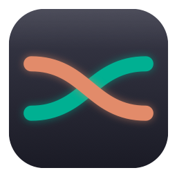

<p align="center">
  
</p>

<h1 align="center">TokenFlow</h1>

<p align="center">
  Claude and Codex rate limits, side by side in your macOS menu bar.<br>
  Native Swift, zero setup for CLI users, credentials never leave your Mac.
</p>

---

Anthropic and OpenAI both meter their coding agents with a **5-hour session window** and a **weekly limit** — and both make you dig for the numbers. This app puts the official percentages in your menu bar as two small ring gauges (coral = Claude, teal = Codex) and warns you before you hit a wall.

## Features

- **Official numbers, not estimates** — the same data `/usage` shows in Claude Code and `/status` shows in Codex, fetched live (session + weekly windows, plus model-scoped weekly limits when your plan has them)
- **Menu bar styles** — ring gauges with or without percentages, plain text, or mini bars; colors shift orange at 70% and red at 90%
- **Liquid Glass popover** on macOS 26 (translucent material on older versions) with per-window progress bars and "resets in 42m" countdowns
- **Notifications** at 70% and 90%, once per window cycle
- **Zero setup** if you use the Claude Code or Codex CLI — it reads their existing logins; otherwise a **Connect** button signs in through your browser (standard OAuth, no cookies, no token pasting)
- **Polite polling** — throttled requests, HTTP 429 backoff with `Retry-After`, cached data shown (marked "cached") when offline or rate-limited
- Hide either provider, refresh interval control, launch at login

## Install

**Build from source** (requires macOS 13+ and Xcode or Command Line Tools):

```sh
git clone https://github.com/wasakunset/tokenflow.git
cd tokenflow
./make-app.sh
open "TokenFlow.app"    # or drag it into /Applications
```

A Homebrew tap and notarized downloads are planned. If you download a pre-built zip from Releases instead of building it yourself, macOS Gatekeeper will warn on first open — right-click the app → **Open** → **Open**.

## First run

1. A welcome card opens from the menu bar and detects which CLIs you have.
2. If Claude Code is found, macOS asks permission to read its login — click **Always Allow** (asked once).
3. If a CLI isn't installed, click **Connect** to sign in through your browser, or **Hide** that provider.

That's the whole setup.

## How it works

| Provider | Data source |
|---|---|
| **Claude** | OAuth token from Claude Code's Keychain item (or an account you connected in-app) → `api.anthropic.com/api/oauth/usage` |
| **Codex** | OAuth token from `~/.codex/auth.json` (or an in-app account) → `chatgpt.com/backend-api/wham/usage`, falling back to the CLI's local session-log snapshot when offline |

Limits are account-wide, so usage from claude.ai, the desktop apps, or the web versions of these tools is included automatically.

## Credentials & privacy

Worth being explicit, since this app touches auth tokens:

- Tokens are read from the CLIs' own storage (macOS Keychain / `~/.codex/auth.json`) and sent **only** to Anthropic's and OpenAI's official API hosts — the exact endpoints the CLIs themselves call. No third-party server, no analytics, no telemetry.
- Accounts connected in-app use the same public OAuth clients the CLIs use (PKCE, in your real browser); those tokens are stored in the app's **own** Keychain item.
- When Claude Code's access token has expired, the app refreshes it and **writes the rotated tokens back to Claude Code's Keychain item** — this keeps both the app and Claude Code working, and is the only write it ever makes to another tool's storage.
- Tokens are never logged, never written to disk in plaintext, and never leave your machine except to the providers' own APIs.

## Disclaimer

Not affiliated with Anthropic or OpenAI. The usage endpoints are the unofficial-but-stable ones the official CLIs use; if a provider changes them, the affected card shows an error (never wrong numbers) until the app is updated.

## Development

```sh
swift run AIUsageTracker             # run the menu bar app directly
swift run AIUsageTracker --print     # print usage to stdout, no GUI
./make-app.sh                        # release build + .app bundle with icon
```

The icon is generated by `scripts/make-icon.swift`; app name and bundle id are variables at the top of `make-app.sh`.

## Roadmap

- Burn-rate prediction ("at this pace you'll hit 100% before the reset")
- Usage history sparklines
- More providers (Gemini CLI, Cursor, Copilot) — the provider protocol is two functions; PRs welcome
- Notarized releases + Homebrew cask

## License

[MIT](LICENSE)
